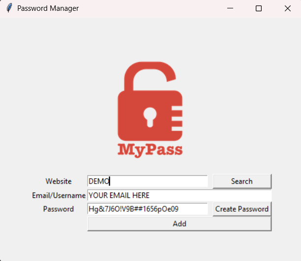

# 🔐 Password Manager (Tkinter GUI)

This is a simple Password Manager built using Python and Tkinter as part of my **100 Days of Code** challenge.

It allows you to:
- Generate strong, random passwords
- Save credentials (website, email/username, password)
- Search for previously saved credentials
- Store data securely in a local JSON file
- Automatically copy generated passwords to clipboard

---

## 🚀 Features

- **Password Generation**: Click to generate a secure password and copy it to clipboard.
- **Save Passwords**: Save login credentials locally in a JSON file.
- **Search Function**: Quickly retrieve credentials by website name.
- **GUI**: Built with Tkinter for an easy-to-use interface.

---

## 🛠️ Tech Stack & Tools

- Python 3.x
- Tkinter (GUI)
- `pyperclip` (Clipboard access)
- `json` & `os` for data management

---

## 🖼️ GUI Screenshot

>  
> 

---

## 📂 Folder Structure

100-days-of-code/
├── Day-41-Password-Manager/
│ ├── password_manager.py
│ ├── password.py
│ ├── data.json
│ ├── logo.png
| └── image.png

---

## ⚙️ How to Run

1. Make sure you have Python 3 installed.
2. Install `pyperclip` if not already:

---

## 📌 Note

This is a local password manager. The data is stored unencrypted in `data.json`. For real-world usage, always use encrypted storage solutions and never hardcode credentials or secrets.

